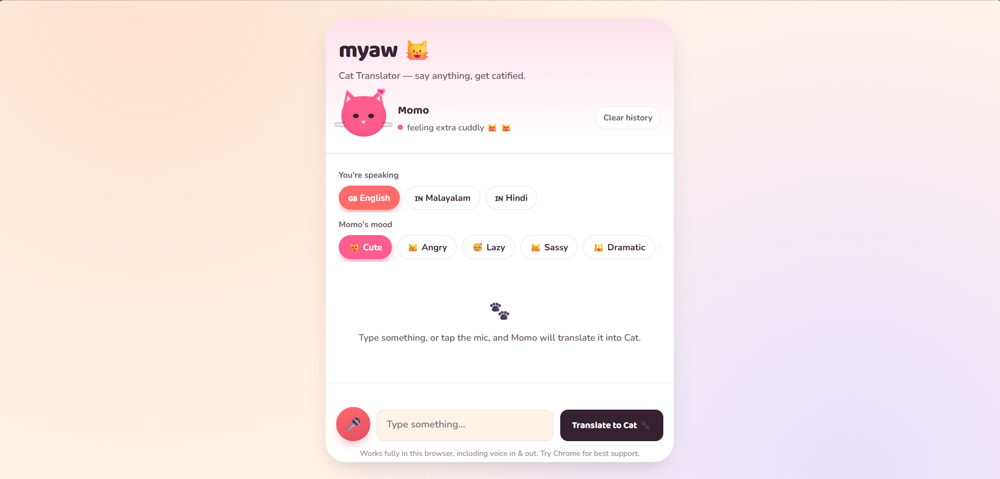
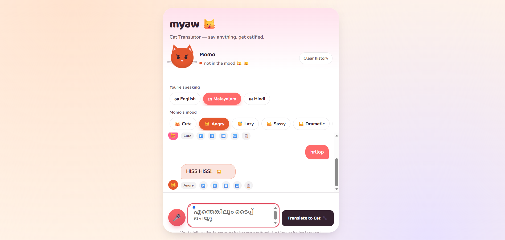
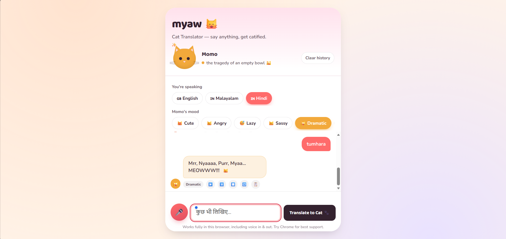
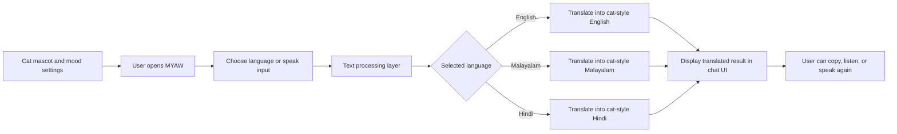

# MYAW 🎯

## Basic Details
### Team Name: COMPOUND V

### Team Members
- Team Lead: Mohammed Harshad - KMEA Engineering College
- Member 2: Mohammed Aman T Z - KMEA Engineering College

### Project Description
MYAW is a playful cat-themed translator that turns everyday text into adorable cat-style output. It supports English, Malayalam, and Hindi, making language translation feel fun, expressive, and a little ridiculous.

The app comes with a cat mascot, mood-based personality toggles, and voice input/output support to create a friendly and interactive experience.

### The Problem (that doesn't exist)
Humans were tired of standard, boring translation tools that never captured personality, emotion, or pure nonsense in a cute way. We needed a translator that could make a simple sentence sound like a cat had written it.

### The Solution (that nobody asked for)
MYAW translates user input into cat-inspired phrases while keeping the meaning easy to understand. It adds a cheerful UI, language switching, mood changes, and browser-based voice features so the experience feels more like an interactive toy than a serious app.

## Technical Details
### Technologies/Components Used
For Software:
- HTML
- CSS
- JavaScript
- Browser Speech Recognition API
- Browser Speech Synthesis API
- Responsive web design for mobile-friendly interface

### Implementation
For Software:
# Installation
```bash
git clone https://github.com/<your-username>/goldencat.git
cd goldencat
```

# Run
```bash
python -m http.server 8000
```
Then open the app in a browser at:
```text
http://localhost:8000
```
You can also open `index.html` directly in a browser for a quick preview.

### Project Documentation
For Software:

# Screenshots (Add at least 3)

*Landing Page*


*Malayalam Chat*


*Hindi Chat*

# Diagrams

*This workflow shows how user input flows through the language modes, gets transformed into cat-style text, and is displayed in the interactive chat interface.*

### Project Demo
# Video
[Demo video link will be added here]
*The demo video explains the app flow, language switching, and the cat-themed interaction experience.*

# Additional Demos
[Live Link](https://mohammedharshad7.github.io/useless_project_temp/)

## Team Contributions
- Mohammed Harshad: UI design, frontend layout, project planning, and team coordination
- Mohammed Aman T Z: app logic, language handling, testing, and documentation support

---
Made with ❤️ at TinkerHub Useless Projects


